# Objective

This is a learning project to explore how agents can cooperate in design collaboration, drawing on the [dust-tt/srchd](https://github.com/dust-tt/srchd) project.

## Try experiment creation

Requires Node.js 24.15+ and npm 12+. With nvm installed, run from this repository:

```bash
nvm install
nvm use
npm install --global npm@12.0.2
npm ci
npm run migrate

npx tsx src/dsgnrd.ts experiment create ben-imo-test \
  -p problems/imo2025/imo2025p5.problem
npx tsx src/dsgnrd.ts experiment list
```

The included problem is srchd's original IMO example, so you can compare the same commands in both projects. Use another experiment name to repeat the exercise.

You should see `ben-imo-test` with `imo2025/imo2025p5.problem` as its stored problem reference. Creation checks that the path exists and saves it; it does not read or copy the problem text. No agents run and no model credentials are needed.

Use `-p /absolute/path/to/your/problem.md` for your own file. Like srchd, folder inputs are also accepted; `problem.md` and optional `data/` are used later when agents run. A nonexistent path fails without creating a record. Names must be unique. Listing an empty database returns a not-found error, as in srchd.

Commands use `./db.sqlite` by default. To use another **dsgnrd** database, set `DATABASE_PATH` to the same path for migration and every command. Keep it separate from srchd's database and run commands from this repository root.

### Follow the code

1. [src/dsgnrd.ts](src/dsgnrd.ts) — create and list commands.
2. [src/lib/problem.ts](src/lib/problem.ts) — check and normalize the path.
3. [src/resources/experiment.ts](src/resources/experiment.ts) — save and retrieve records.
4. [src/db/schema.ts](src/db/schema.ts) — the experiment fields.
5. [src/db/index.ts](src/db/index.ts) — connect to SQLite.

See [upstream provenance](docs/upstream.md) for the source commit and exactly what was brought over. Run `npm run typecheck` and `npm test` to verify this slice. Tests migrate an isolated temporary database and exercise the CLI in separate processes.

### Implemented schema

Only `experiments` is implemented in this first step, with srchd's unchanged fields and uniqueness constraint. It has no relationships yet.



[Mermaid source](docs/diagrams/dsgnrd-current.mmd)

## From research to design

The aim is to preserve srchd's architecture and learn by adapting its problems, prompts, and content to design collaboration. The same relationships connect agents, their contributions, their reviews, and the solutions they currently favor.

**Status:** the full charts below describe the target model. Only `experiments` is implemented so far; agents, publications, and the other tables remain planned. The proposed design meanings preserve srchd's table names and relationships. `experiments.problem` stores a file or folder reference, not the brief text.

The full model is shown in the same two views as the Notion diagrams: collaboration, then agent history and usage. Both columns preserve the same fields and relationships.

<table>
  <tr>
    <th width="50%">srchd · Research collaboration</th>
    <th width="50%">dsgnrd · Proposed design interpretation</th>
  </tr>
  <tr><th colspan="2">Research and collaboration</th></tr>
  <tr>
    <td valign="top"><a href="docs/diagrams/srchd-model.svg"></a></td>
    <td valign="top"><a href="docs/diagrams/dsgnrd-model.svg"></a></td>
  </tr>
  <tr><th colspan="2">Agent history and usage</th></tr>
  <tr>
    <td valign="top"><a href="docs/diagrams/srchd-history.svg"></a></td>
    <td valign="top"><a href="docs/diagrams/dsgnrd-history.svg"></a></td>
  </tr>
</table>

Click a diagram to open it at full size. **PK** = primary key, **FK** = foreign key, **UK** = unique key. Relationship endpoints indicate exactly one, zero or one, or zero or many.

All nine tables are represented; `agents` appears in both views. As in the Notion charts, the shared `created` and `updated` timestamps and repeated experiment relationships are omitted. Every table other than `experiments` has a required experiment foreign key, shown in its field list.

A citation connects a citing publication (`from`) to a cited publication (`to`). A solution records an agent's current position and rationale, with an optional publication reference; it is not a final human decision. `solutions.content` is the SQL column for the TypeScript property `rationale`. Review grade and content can be null while a review is pending. Message content is JSON stored as SQLite text.

Composite uniqueness constraints are unchanged:

| Table | Unique columns |
| --- | --- |
| `agents` | `experiment` + `name` |
| `publications` | `experiment` + `reference` |
| `reviews` | `author` + `publication` |
| `citations` | `experiment` + `from` + `to` |
| `messages` | `experiment` + `agent` + `position` |

`experiments.name` is also unique. The foreign keys alone do not enforce that linked records belong to the same experiment.

Source: [srchd's database schema](https://github.com/dust-tt/srchd/blob/4b5ffb44bdc6bb1d2181d746ec951dd30f89ed08/src/db/schema.ts), checked on 2026-10-09. Editable Mermaid sources: [srchd collaboration](docs/diagrams/srchd-model.mmd) · [dsgnrd collaboration](docs/diagrams/dsgnrd-model.mmd) · [srchd history](docs/diagrams/srchd-history.mmd) · [dsgnrd history](docs/diagrams/dsgnrd-history.mmd). SVG exports keep each comparison side by side in the README.
