# Objective

This is a learning project to explore how agents can cooperate in design collaboration, drawing on the [dust-tt/srchd](https://github.com/dust-tt/srchd) project.

# How to start - Create an experiment from a demo problem

Requires Node.js 24.15+ and npm 12+. With nvm installed, run from this repository:

```bash
nvm install
nvm use
npm install --global npm@12.0.2
npm ci
npm run migrate

npx tsx src/dsgnrd.ts experiment create oldskaters-reveal \
  -p problems/oldskaters/trick-reveal
npx tsx src/dsgnrd.ts experiment list
```

The included [Oldskaters problem](problems/oldskaters/trick-reveal/problem.md) explores trick-video aspect ratios while preserving the fun of the reveal. Use another experiment name to repeat the exercise.

You should see `oldskaters-reveal` with `oldskaters/trick-reveal` as its stored problem reference. The command passes the folder containing `problem.md`, following srchd's folder convention. Creation checks that the path exists and saves it; it does not read or copy the problem text. No agents run and no model credentials are needed.

Use `-p /absolute/path/to/your/problem.md` for your own file. Like srchd, folder inputs are also accepted; `problem.md` and optional `data/` are used later when agents run. A nonexistent path fails without creating a record. Names must be unique. Listing an empty database returns a not-found error, as in srchd.

Commands use `./db.sqlite` by default. To use another **dsgnrd** database, set `DATABASE_PATH` to the same path for migration and every command. Keep it separate from srchd's database and run commands from this repository root.

# Learning from srchd

To optimise for learning, I chose to preserve srchd's architecture as much as possible. The same relationships connect agents, their contributions, their reviews, and the solutions they currently favor.

**Status:** the full charts below describe the target model. Only `experiments` is implemented so far; agents, publications, and the other tables remain planned. The proposed design meanings preserve srchd's table names and relationships. `experiments.problem` stores a file or folder reference, not the brief text.

The full model is shown in the same two views as the Notion diagrams: collaboration, then agent history and usage. Both columns preserve the same fields and relationships.

<table>
  <tr>
    <th width="50%">srchd · Research collaboration</th>
    <th width="50%">dsgnrd · Proposed design interpretation</th>
  </tr>
  <tr><th colspan="2">Research and collaboration</th></tr>
  <tr>
    <td valign="top"><a href="docs/diagrams/srchd-model.svg"></a></td>
    <td valign="top"><a href="docs/diagrams/dsgnrd-model.svg"></a></td>
  </tr>
  <tr><th colspan="2">Agent history and usage</th></tr>
  <tr>
    <td valign="top"><a href="docs/diagrams/srchd-history.svg"></a></td>
    <td valign="top"><a href="docs/diagrams/dsgnrd-history.svg"></a></td>
  </tr>
</table>

Click a diagram to open it at full size.

Composite uniqueness constraints are unchanged:

| Table          | Unique columns                      |
| -------------- | ----------------------------------- |
| `agents`       | `experiment` + `name`               |
| `publications` | `experiment` + `reference`          |
| `reviews`      | `author` + `publication`            |
| `citations`    | `experiment` + `from` + `to`        |
| `messages`     | `experiment` + `agent` + `position` |

`experiments.name` is also unique. The foreign keys alone do not enforce that linked records belong to the same experiment.

Source: [srchd's database schema](https://github.com/dust-tt/srchd/blob/4b5ffb44bdc6bb1d2181d746ec951dd30f89ed08/src/db/schema.ts), checked on 2026-10-09. Editable Mermaid sources: [srchd collaboration](docs/diagrams/srchd-model.mmd) · [dsgnrd collaboration](docs/diagrams/dsgnrd-model.mmd) · [srchd history](docs/diagrams/srchd-history.mmd) · [dsgnrd history](docs/diagrams/dsgnrd-history.mmd). SVG exports keep each comparison side by side in the README.
